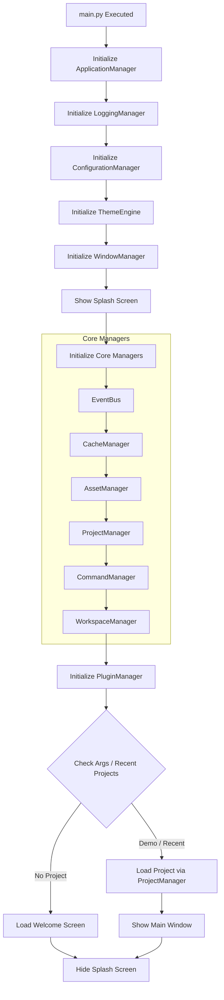

# Startup Flow

To ensure a smooth, crash-free startup experience, ZANIME follows a strict initialization order.

## Flow Description

1. **Logging First**: The `LoggingManager` must be initialized immediately to catch errors during the rest of the startup process.
2. **Configuration Second**: `ConfigurationManager` reads user and system preferences.
3. **Theme Third**: `ThemeEngine` needs to be ready so that the `SplashScreen` and all subsequent UI elements look correct immediately.
4. **Splash Screen**: Displayed as soon as basic Qt elements are ready, giving the user immediate visual feedback while heavy managers load.
5. **Core Managers**: Initialized in order of dependency. (e.g., `ProjectManager` might need `AssetManager`).
6. **Plugins Last**: Plugins are loaded last because they rely on the Core Managers being fully initialized and the `EventBus` being active.
